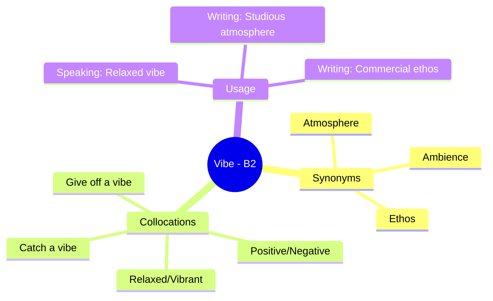

## 1.Vibe(B2)

```mermaid
mindmap
  root((Vibe - B2))
    Synonyms
      Atmosphere
      Ambience
      Ethos
    Collocations
      Positive/Negative
      Relaxed/Vibrant
      Give off a vibe
      Catch a vibe
    Usage
      Speaking: Relaxed vibe
      Writing: Studious atmosphere
      Writing: Commercial ethos
```

